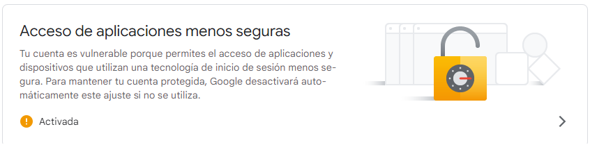

# Leviatan

Proyecto realizado en Python. en el framework de Django y el administrador de bases de datos postgreSQL.

### Diseño

Framework de Facebook --> Tailwind

### Otras funcionalidades

1. [x] Recuperación contraseña por correo
1. [x] Verficación de correo electronico

